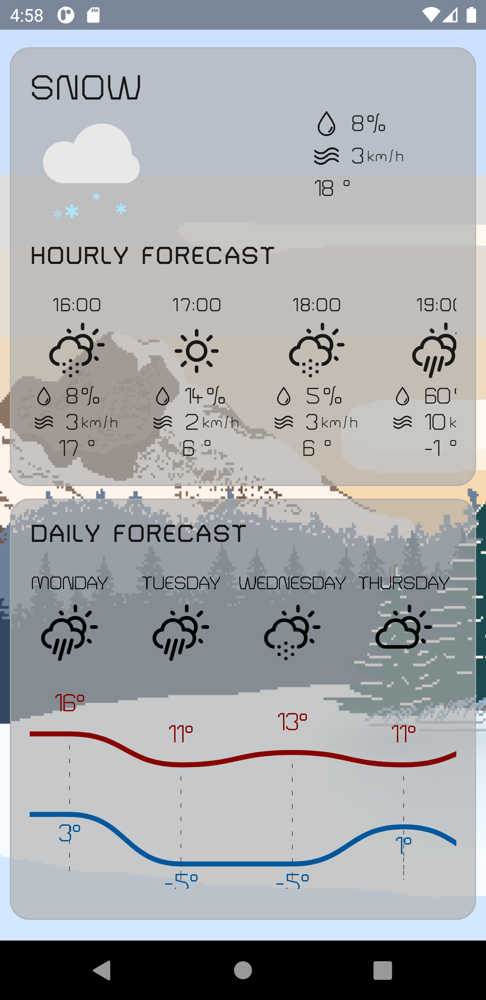

# Weather Rdy

Kotlin application that uses Jetpack-compose to build its views. This is part of the android developers challenge number 4: build a weather application.


## :scroll: Description
Weather Rdy application displays the weather by hour and by day of the week, changing the background and animation based on the current weather and day/night time.

## :camera_flash: Screenshots

 




## License
```
Copyright 2020 The Android Open Source Project

Licensed under the Apache License, Version 2.0 (the "License");
you may not use this file except in compliance with the License.
You may obtain a copy of the License at

    https://www.apache.org/licenses/LICENSE-2.0

Unless required by applicable law or agreed to in writing, software
distributed under the License is distributed on an "AS IS" BASIS,
WITHOUT WARRANTIES OR CONDITIONS OF ANY KIND, either express or implied.
See the License for the specific language governing permissions and
limitations under the License.
```